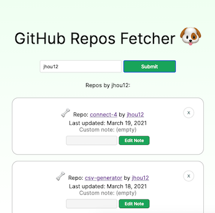

# Fullstack GitHub Repos Fetcher

App that makes a request to the GitHub API, retrieves a list of the selected user's repos, and automatically saves results to the database after each search. Implemented with full CRUD functionality, including the ability to view saved posts on refresh (most recent 25 sorted by date last updated), add custom notes, and delete entries. Made with the MERN/SERN stack (connection options are available for both Mongo and MySQL), as well as React Styled Components and hooks.

## Setup:

1. `git clone`
1. install dependencies with `npm install`
1. connect desired database in `server/index.js`, add `.env` file with db credentials, and start server with `npm run start`
1. build bundle with `npm run build`
1. verify app up and running at `localhost:3000`
1. for development, start webpack with `npm run react-dev`